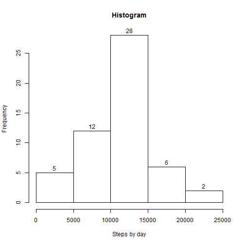
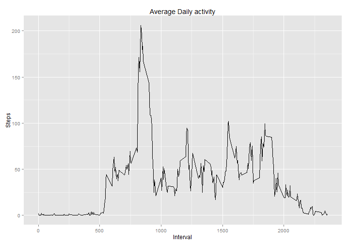
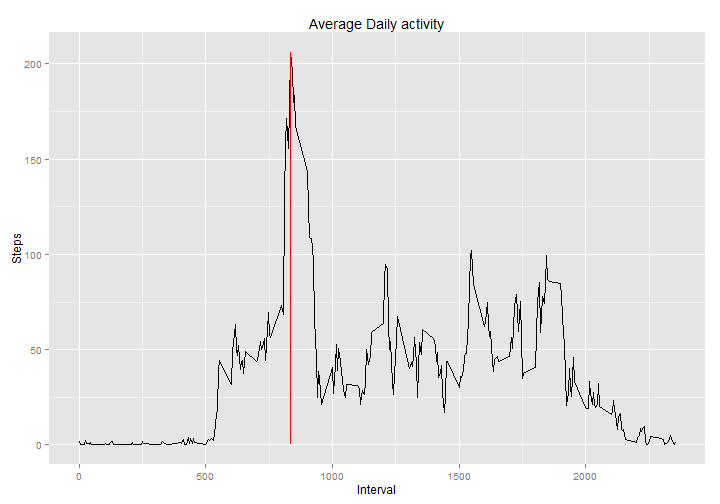
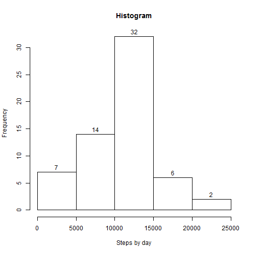
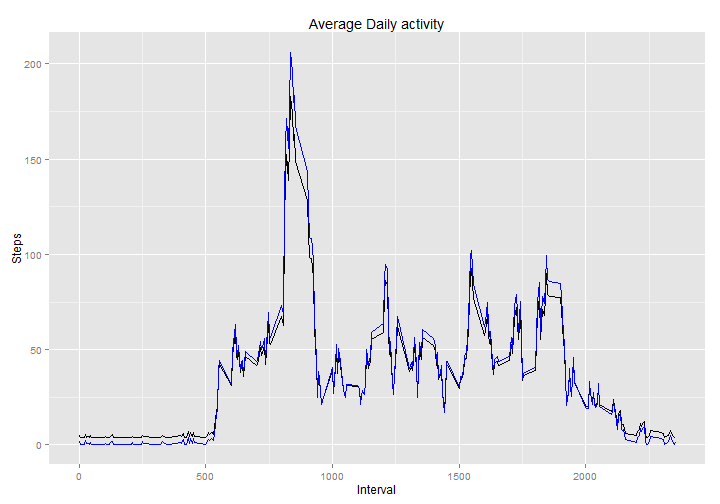
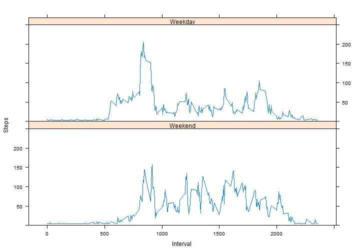

# Reproducible Research: Peer Assessment 1


## Loading and preprocessing the data

```r
library(ggplot2)
library(chron)
```
Verify if dataset exists:

```r
if(!file.exists("./activity.zip")){
    download.file("https://d396qusza40orc.cloudfront.net/repdata%2Fdata%2Factivity.zip",
                  "activity.zip")
}
```
Unpack the dataset:

```r
if(!file.exists("./data/activity.csv")){
    if(file.exists("activity.zip")){
        unzip("activity.zip", exdir="data")
    }else{
        stop("The dataset not exists")
    }
}
```
Load the data:

```r
dataAct<-read.csv("./data/activity.csv")
```
Summarize the dataset:

```r
summary(dataAct)
```

```
##      steps               date          interval   
##  Min.   :  0.0   2012-10-01:  288   Min.   :   0  
##  1st Qu.:  0.0   2012-10-02:  288   1st Qu.: 589  
##  Median :  0.0   2012-10-03:  288   Median :1178  
##  Mean   : 37.4   2012-10-04:  288   Mean   :1178  
##  3rd Qu.: 12.0   2012-10-05:  288   3rd Qu.:1766  
##  Max.   :806.0   2012-10-06:  288   Max.   :2355  
##  NA's   :2304    (Other)   :15840
```

## What is mean total number of steps taken per day?

The total of steps by day:

```r
stepsbyday<-tapply(dataAct$steps, dataAct$date, sum)

head(stepsbyday)
```

```
## 2012-10-01 2012-10-02 2012-10-03 2012-10-04 2012-10-05 2012-10-06 
##         NA        126      11352      12116      13294      15420
```
The histogram of the steps by day:

```r
hist(stepsbyday, xlab="Steps by day", main="Histogram", labels=T)
```



Calculate the mean and median:

```r
mu<-mean(stepsbyday, na.rm=T)
md<-median(stepsbyday, na.rm=T)
```

The mean is: 10766 *Steps by day*  
The median is: 10765 *Steps by day*

## What is the average daily activity pattern?

Plotting the average daily activity:

```r
qplot(interval, steps, data = dataAct, 
             geom = "line", 
             ylab="Steps", 
             xlab="Interval", 
             main="Average Daily activity", 
             stat="summary", fun.y = "mean")
```

```
## Warning: Removed 2304 rows containing missing values (stat_summary).
```



Calculate the average daily activity

```r
averageSteps<-aggregate(steps~interval, FUN=mean, data=dataAct)
maxIndex<-which.max(averageSteps$steps)
val<-averageSteps[maxIndex,]
```

The interval 835 has the maximum average of steps (206.1698): 

```r
plot1<-qplot(interval, steps, data = averageSteps, 
             geom = "line", 
             ylab="Steps", 
             xlab="Interval", 
             main="Average Daily activity", 
             stat="summary", fun.y = "mean")
plot1+geom_segment(aes(x = val$interval, y = 0, xend = val$interval, yend = val$steps), colour = "red" )
```



## Imputing missing values

Calculate the number of NAs values:

```r
naVal<-data.frame(steps=0, date=0, interval=0)

naVal$steps<-length(which(is.na(dataAct$steps)))

naVal$date<-length(which(is.na(dataAct$date)))

naVal$interval<-length(which(is.na(dataAct$interval)))
```

The number of rows with NAs from steps column is 2304  
The number of rows with NAs from interval column is 0  
The number of rows with NAs from date column is 0

Filling the NA values from Steps columns

```r
#Backuo the dataset
dataActOld<-dataAct
missValues<-dataAct[is.na(dataAct$steps), ]
summary(missValues)
```

```
##      steps              date        interval   
##  Min.   : NA    2012-10-01:288   Min.   :   0  
##  1st Qu.: NA    2012-10-08:288   1st Qu.: 589  
##  Median : NA    2012-11-01:288   Median :1178  
##  Mean   :NaN    2012-11-04:288   Mean   :1178  
##  3rd Qu.: NA    2012-11-09:288   3rd Qu.:1766  
##  Max.   : NA    2012-11-10:288   Max.   :2355  
##  NA's   :2304   (Other)   :576
```

```r
missDate<-sort(as.Date(as.character(unique(missValues$date))))
missInterval<-unique(missValues$interval)

#Get the interval Date
rangeDate<-range(as.Date(as.character(dataAct$date)))

#Get the length of the Dates Column
dateLen<-length(unique(as.character(dataAct$date)))-1

#Calculate the mean of the date to fill the NA's values
for(date in missDate){
    convDate<-as.character(as.Date(date, origin= "1970-01-01"))
    #Verify if date is in maximum or minimum Date
    if(!(date %in% rangeDate)){
        #The midle dates are the mean between the next and before values
        for(i in -1:-dateLen){
            tempDate<-as.character(as.Date(date+i, origin= "1970-01-01"))
            dataSub<-subset(dataAct, subset=dataAct$date==tempDate)
            #Select just the groups without NA's values
            if(length(dataSub[!is.na(dataSub$steps), "steps" ]) > 0){                    
                valM1<-mean(dataSub$steps)
                valM2<-0
                
                #get the next vakue
                for(i in 1:dateLen){
                    tempDate<-as.character(as.Date(date+i, origin= "1970-01-01"))
                    dataSub<-subset(dataAct, subset=dataAct$date==tempDate)
                    #Select just the groups without NA's values
                    if(length(dataSub[!is.na(dataSub$steps), "steps" ]) > 0){                    
                        valM2<-mean(dataSub$steps)                                                                    
                        break
                    }
                }
                valM<-(valM1+valM2)/2
                dataAct$steps[dataAct$date == convDate]<-valM
                
                break
            }#                 
        }
    }else{ #The first date is filled by the mean value of the next date
        if(date == rangeDate[1]){            
            for(i in 1:dateLen){
                tempDate<-as.character(as.Date(date+i, origin= "1970-01-01"))
                dataSub<-subset(dataAct, subset=dataAct$date==tempDate)
                #Select just the groups without NA's values
                if(length(dataSub[!is.na(dataSub$steps), "steps" ]) > 0){                    
                    valMean<-mean(dataSub$steps)                    
                    #Set the value of mean in the NA's rowns of  step
                    dataAct$steps[dataAct$date == convDate]<-valMean
                    break
                }#                 
            }
        }else{ #The last date is filled by the mean value of the before date
            for(i in -1:-dateLen){
                tempDate<-as.character(as.Date(date+i, origin= "1970-01-01"))
                dataSub<-subset(dataAct, subset=dataAct$date==tempDate)
                #Select just the groups without NA's values
                if(length(dataSub[!is.na(dataSub$steps), "steps" ]) > 0){                    
                    valMean<-mean(dataSub$steps)                    
                    #Set the value of mean in the NA's rowns of  step
                    dataAct$steps[dataAct$date == convDate]<-valMean
                    break
                }#                 
            }
        }
    }
}
```

Saving the new dataset

```r
write.csv(dataAct, "./data/activity_without_NA.csv")
```

Plotting the new histogram

```r
stepsbyday2<-tapply(dataAct$steps, dataAct$date, sum)
hist(stepsbyday2, xlab="Steps by day", main="Histogram", labels=T)
```



Calculate the new mean and median:

```r
mu2<-mean(stepsbyday2)
md2<-median(stepsbyday2)
```

The new mean is: 10411 *Steps by day*  
The new median is: 10571 *Steps by day*  

The difference between the new and old mean/median is:  
*Mean: -355.2256*  
*Median: -194*  

*As can be seen, theses values differ from the estimates of the dataset with NA's values.*  
  


```r
stepsbyact<-tapply(dataAct$steps, dataAct$date, sum)
plot1<-qplot(interval, steps, data = dataAct, 
             geom = "line", 
             ylab="Steps", 
             xlab="Interval", 
             main="Average Daily activity", 
             stat="summary", fun.y = "mean")
plot1+geom_line(data=dataActOld, colour="blue", stat="summary", fun.y = "mean")
```

```
## Warning: Removed 2304 rows containing missing values (stat_summary).
```



*The main impact of imputing missing data is on the mean value of the steps by day, where these values was estimated by mean of the steps in the neighbor date. In the graph the blue line is the time seris from the dataset with NA's values*

## Are there differences in activity patterns between weekdays and weekends?
Setting the weekdays and the weekends

```r
dataAct$week<-factor(is.weekend(dataAct$date), levels=c(T, F), labels=c("Weekend", "Weekday"))
summary(dataAct)
```

```
##      steps               date          interval         week      
##  Min.   :  0.0   2012-10-01:  288   Min.   :   0   Weekend: 4608  
##  1st Qu.:  0.0   2012-10-02:  288   1st Qu.: 589   Weekday:12960  
##  Median :  0.0   2012-10-03:  288   Median :1178                  
##  Mean   : 36.1   2012-10-04:  288   Mean   :1178                  
##  3rd Qu.: 27.5   2012-10-05:  288   3rd Qu.:1766                  
##  Max.   :806.0   2012-10-06:  288   Max.   :2355                  
##                  (Other)   :15840
```
    
Plotting the average number of step by weekend

```r
library(lattice)
xyplot(steps ~ interval | week,        
       data=dataAct, 
       type = "a", ylab="Steps", xlab="Interval", layout=c(1,2), ylim=c(0,250))
```



*As can be seen, the activity patterns between weekdays and weekends values are different*

